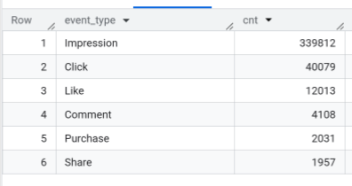
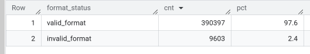
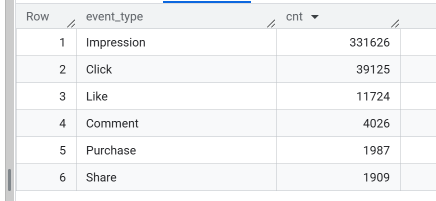

### Payment Analytics

# Data Quality & Validation — `ad_events_stg`

## Data Quality & Validation

The following validation checks were performed:

- Checked column names and data types using `INFORMATION_SCHEMA.COLUMNS`.
- Compared total rows with the number of unique `event_id` values to identify duplicates.
- Checked key columns for `NULL` values.
- Analyzed the distribution of `event_type`.
  

- Validated `day_of_week` against the date calculated from `timestamp`.
- Identified users with unusually high numbers of events.
- Analyzed the distribution of `event_type`.
  

- Validated the format of `user_id` using regular expressions.
- Checked the minimum and maximum event dates.
- Verified the number of distinct months represented in the dataset.

## Data Cleaning

A cleaned analytical table, `cln_ad_events`, was created from the staging table.

### Cleaning Steps

- Removed records with invalid `user_id` values.
- Converted `timestamp` into separate `event_timestamp` and `event_date` fields.
- Retained only records with a valid hexadecimal `user_id` format.
- Rechecked the cleaned dataset for `NULL` values and duplicate `event_id` records.
- Revalidated the distribution of `event_type` after cleaning.

## Results

- **Initial dataset:** approximately 40,000 rows.
- **NULL values:** no `NULL` values were detected in the validated key columns.
- **Invalid `user_id` records:** 9,603 records were identified as invalid.
- **Cleaning action:** all 9,603 invalid records were removed.
- **Valid records remaining:** approximately 30,397 records.
- **User ID validation:** valid `user_id` values were retained based on the hexadecimal format `^[0-9a-fA-F]+$`.
- **Final table:** `cln_ad_events` contains the cleaned data prepared for further analytical work.
  
  

## Data Quality & Validation — `ads_stg`

### Validation Checks

The following validation checks were performed:

- Checked for `NULL` values in key columns, including `ad_id` and `campaign_id`.
- Validated `ad_id` and `campaign_id` formats using `SAFE_CAST`.
- Checked for duplicate `ad_id` values.
- Checked for missing or empty values in key text fields.
- Validated categorical fields against the expected domain values for `ad_platform`, `ad_type`, `target_gender`, and `target_age_group`.
- Checked `target_interests` for formatting inconsistencies, including duplicate commas and excessive whitespace.

## Data Cleaning

### Cleaned Analytical Table

A cleaned analytical table, `cln_ads`, was created from the staging table `ads_stg`.

The cleaning process included:

- Validating key identifiers and text fields.
- Checking categorical fields against expected domain values.
- Checking text fields for formatting inconsistencies.
- Creating the `cln_ads` table for further analytical processing.

## Results

### Validation Results

The validation process confirmed that the main data quality checks were performed before analytical processing:

- **NULL values:** checked in key columns.
- **ID formats:** validated using `SAFE_CAST`.
- **Duplicates:** checked for duplicate `ad_id` values.
- **Categorical fields:** validated against expected domain values.
- **Text formatting:** checked for inconsistencies in `target_interests`.
- **Final table:** `cln_ads` was created as the cleaned analytical table for further analysis.
